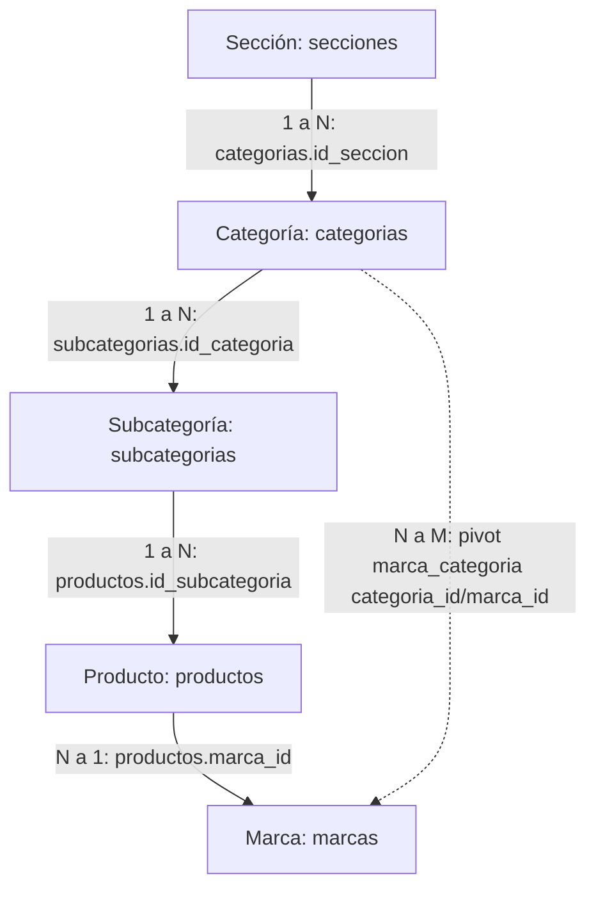

# Plan Técnico: Filtrado Dinámico de Marcas por Sección en el Home (Index)

> **Estado:** Revisado y verificado contra el código fuente (todos los archivos, relaciones y líneas citadas fueron confirmados en el repo).
> **Alcance:** Cambio aditivo y de bajo riesgo — 1 ruta nueva, 1 método nuevo, 1 prop nueva. Ningún archivo existente de categorías se toca.

---

## 1. Planteamiento Específico del Problema

### Contexto Actual (verificado)
En la página de inicio ([Welcome.jsx](file:///c:/Users/Frank/Documents/CODE/megaEquipamiento/resources/js/Pages/Welcome.jsx)), el usuario dispone de un menú flotante de secciones (`SectionsFloatingMenu` → [SectionsNavRail.jsx](file:///c:/Users/Frank/Documents/CODE/megaEquipamiento/resources/js/Components/home/SectionsNavRail.jsx)) que permite seleccionar una sección (ejemplo: *"Instrumentos de medida"*).
Actualmente, al hacer clic en una sección:
1. `handleSelectSeccion` (Welcome.jsx:72) actualiza el estado `selectedSeccion`.
2. El bloque central intercambia [Categorias_cuadrado.jsx](file:///c:/Users/Frank/Documents/CODE/megaEquipamiento/resources/js/Components/home/Categorias_cuadrado.jsx) por [SeccionProductosPreview.jsx](file:///c:/Users/Frank/Documents/CODE/megaEquipamiento/resources/js/Components/home/SeccionProductosPreview.jsx) (que ya consume `/api/secciones/{id}/categorias` con caché en memoria + `AbortController`).
3. **El problema:** Más abajo, [BrandSection.jsx](file:///c:/Users/Frank/Documents/CODE/megaEquipamiento/resources/js/Components/home/BrandSection.jsx) permanece estático: no recibe props, siempre consume `/marca/all` y muestra el listado global de marcas sin importar la sección activa.

### Detalles del comportamiento actual de `BrandSection` (relevantes para el refactor)
- El `useEffect` de carga tiene dependencias `[]` (solo corre al montar) → **debe reaccionar a `seccion.id_seccion`**.
- La carga inicial es *lazy*: un `IntersectionObserver` dispara el fetch solo cuando la sección es visible (umbral 0.1) y se desconecta tras la primera carga.
- Cachea la respuesta global en `localStorage` (`brandsData` + `brandsDataTimestamp`, TTL 1 hora).
- `BrandCard` consume los campos: `id_marca`, `nombre`, `descripcion`, `imagen`, `video_url`.

### Requerimiento del Negocio
1. **Sincronización Sección → Marcas:** Al seleccionar una sección en el Index, el bloque de marcas debe mostrar **únicamente las marcas asociadas a dicha sección** (vía `marca_categoria` o vía productos).
2. **Preservación estricta de la funcionalidad por Categorías (No-Regresión):** **NO** tocar [Categoria.jsx](file:///c:/Users/Frank/Documents/CODE/megaEquipamiento/resources/js/Pages/Categoria.jsx), [CategoryBrandSection.jsx](file:///c:/Users/Frank/Documents/CODE/megaEquipamiento/resources/js/Components/categoria/CategoryBrandSection.jsx) ni `CategoriaController::CategoriasWiew`. La no-regresión se garantiza por **aislamiento**, no por añadir más ramas al componente.
3. **Sin sección activa (`selectedSeccion === null`):** comportamiento idéntico al actual (`/marca/all` + caché `localStorage`).

---

## 2. Arquitectura de Datos y Relaciones (verificadas en los modelos)



Relaciones Eloquent ya existentes (no hay que crear ninguna):
| Modelo | Relación | Definición |
| :--- | :--- | :--- |
| `Marca` | `categorias()` | `belongsToMany(Categoria, 'marca_categoria', 'marca_id', 'categoria_id')` |
| `Marca` | `productos()` | `hasMany(Producto, 'marca_id', 'id_marca')` |
| `Producto` | `subcategoria()` | `belongsTo(Subcategoria, 'id_subcategoria')` |
| `Subcategoria` | `categoria()` | (usada por `Seccion::getAllProductos()`) |
| `Categoria` | `seccion()` | `belongsTo(Seccion, 'id_seccion')` |

**Regla de pertenencia** — una marca pertenece a la sección `S` si se cumple *cualquiera* de:
1. Está vinculada en `marca_categoria` a una categoría con `id_seccion = S`.
2. Tiene al menos un producto cuya subcategoría cuelga de una categoría con `id_seccion = S`.

---

## 3. Propuesta de Cambios por Componente

### Backend (Laravel)

#### [MODIFY] [routes/web.php](file:///c:/Users/Frank/Documents/CODE/megaEquipamiento/routes/web.php)
Agregar **una línea** junto a los endpoints públicos de secciones existentes (después de la línea 364, `api.secciones.categorias`):
```php
Route::get('/api/secciones/{id}/marcas', [SeccionController::class, 'marcasApi'])->name('api.secciones.marcas');
```

#### [MODIFY] [app/Http/Controllers/SeccionController.php](file:///c:/Users/Frank/Documents/CODE/megaEquipamiento/app/Http/Controllers/SeccionController.php)
1. Añadir el import: `use App\Models\Marca;`
2. Añadir el método (mismo patrón que `categoriasApi`):

```php
/**
 * API: marcas asociadas a una sección (público).
 * Una marca pertenece a la sección si está vinculada a alguna de sus
 * categorías (marca_categoria) o si tiene productos en ellas.
 */
public function marcasApi($id)
{
    $seccion = Seccion::activo()->findOrFail($id);

    $marcas = Marca::query()
        ->where(function ($q) use ($seccion) {
            $q->whereHas('categorias', fn ($c) => $c->where('categorias.id_seccion', $seccion->id_seccion))
                ->orWhereHas('productos.subcategoria.categoria', fn ($c) => $c->where('categorias.id_seccion', $seccion->id_seccion));
        })
        ->orderBy('nombre')
        ->get();

    return response()->json($marcas);
}
```

**Notas de implementación:**
- Devuelve el modelo completo (mismo *shape* que `/marca/all` en `MarcaController::getMarcas`): incluye `id_marca`, `nombre`, `descripcion`, `imagen`, `video_url` (+ `imagen_url` *appended*). Esto garantiza que `BrandCard` funcione sin cambios.
- `->get()` sin `select()` a propósito: paridad exacta con `/marca/all`.
- 404 automático vía `findOrFail` si la sección no existe o está inactiva — consistente con `productosApi`/`categoriasApi`.
- **Sin caché de servidor en v1.** La consulta son 2 `whereHas` (barata) y las marcas filtradas se cachean en el cliente. Si en el futuro se detecta latencia, la opción sería `Cache::remember("seccion_{$id}_marcas", 3600, ...)`, pero eso exige invalidar en `MarcaController`/`ProductoController` (patrón `Cache::forget('todas_categorias')`) — fuera de alcance ahora.

---

### Frontend (React / Inertia)

#### [MODIFY] [resources/js/Components/home/BrandSection.jsx](file:///c:/Users/Frank/Documents/CODE/megaEquipamiento/resources/js/Components/home/BrandSection.jsx)

Firma nueva (solo 2 props opcionales; **se elimina la prop `categoria` del borrador original** — ver §5, decisión D1):
```jsx
export default function BrandSection({ seccion = null, marcas: marcasProp = null })
```

**Lógica de prioridades (en orden):**
1. **`marcasProp` explícitas** → usar directamente, sin fetch (reutilización futura; hoy nadie la pasa).
2. **`seccion` presente** → `GET ${URL_API}/api/secciones/${seccion.id_seccion}/marcas`.
3. **Sin props / `seccion === null`** → comportamiento original intacto: `/marca/all` con caché `localStorage` (1h).

**Reglas de implementación obligatorias (lecciones del código existente):**

- **R1 — Aislamiento de cachés (crítico):** las marcas filtradas por sección **JAMÁS** se escriben en `localStorage['brandsData']`. Esa clave es exclusiva del listado global; sobrescribirla con un subconjunto filtrado rompería la vista por defecto tras recargar. Para secciones se usa un caché **en memoria a nivel de módulo**, copiando el patrón de `SeccionProductosPreview.jsx`:
  ```js
  const seccionMarcasCache = {}; // { [id_seccion]: Marca[] } — vive mientras dure la sesión de la página
  ```
- **R2 — Cancelación de peticiones:** al cambiar rápido de sección, usar `AbortController` + flag `cancelled` (mismo patrón que `SeccionProductosPreview`, líneas 132-165) para evitar *race conditions* donde una respuesta lenta pise a la sección nueva.
- **R3 — Preservar la carga *lazy*:** separar en dos efectos:
  - Efecto A (mount, `[]`): el `IntersectionObserver` actual; al hacerse visible → `setHasBeenVisible(true)`.
  - Efecto B (`[hasBeenVisible, seccion?.id_seccion, marcasProp]`): si `!hasBeenVisible` no hace nada; si es visible, ejecuta la rama correspondiente (1, 2 o 3).
  - Así, la carga inicial sigue siendo diferida y los cambios de sección posteriores disparan fetch inmediato.
- **R4 — Restauración al volver a `null`:** si `seccion` vuelve a `null`, la rama 3 relee `localStorage` (cache hit instantáneo en la práctica) o refetchea `/marca/all`. No se requiere estado extra.
- **R5 — Título dinámico (mínimo):**
  ```jsx
  {seccion ? `Marcas de ${seccion.nombre}` : 'Marcas'}
  ```
- **R6 — Estado vacío con sección activa:** mostrar `"No hay marcas asociadas a esta sección."` (mensaje honesto del filtro). **NO** hacer *fallback* silencioso a todas las marcas — confundiría al usuario sobre qué filtro está activo. *(Decisión de negocio D2, confirmar si se prefiere otra cosa.)*
- **R7 — Orden:** el endpoint ya ordena alfabéticamente; mantener el `sort` defensivo del cliente solo en la rama global (comportamiento actual).

`BrandCard` **no se modifica** (los campos que usa vienen garantizados por el endpoint).

#### [MODIFY] [resources/js/Pages/Welcome.jsx](file:///c:/Users/Frank/Documents/CODE/megaEquipamiento/resources/js/Pages/Welcome.jsx)
Cambio de **una línea** (línea 255):
```jsx
<BrandSection seccion={selectedSeccion} />
```
`selectedSeccion` ya es el objeto completo de `/api/secciones` (`id_seccion`, `nombre`, `slug`, `imagen`, `descripcion`, `orden` — ver `useSecciones.js`), por lo que no hace falta estado ni efectos adicionales. El clic en el rail actualiza en sincronía el bloque de categorías y el de marcas.

**Archivos explícitamente NO tocados:** `SectionsNavRail.jsx`, `SectionsFloatingMenu.jsx`, `useSecciones.js`, `Categoria.jsx`, `CategoryBrandSection.jsx`, `CategoriaController.php`, `MarcaController.php`, `Subcategorias.jsx`.

---

## 4. Decisiones clave (resueltas al revisar el código)

| # | Decisión | Resolución | Motivo |
| :--- | :--- | :--- | :--- |
| **D1** | ¿Prop `categoria` en `BrandSection`? | **Descartada** | El filtrado por categoría ya existe y es server-side (`CategoriasWiew` → `CategoryBrandSection`). Añadir otra rama de fetch es complejidad sin beneficio (YAGNI). La prop `marcas` cubre la reutilización futura. |
| **D2** | Sección sin marcas | **Mensaje vacío, sin fallback** (recomendado) | Un fallback silencioso rompe el modelo mental del filtro. ⚠️ *Confirmar con negocio si se prefiere ocultar el bloque completo.* |
| **D3** | "Deseleccionar" sección | **No existe hoy; fuera de alcance** | `handleSelectSeccion` (Welcome.jsx:72-77) nunca pone `null`: re-clic en la misma sección hace *reshuffle* (`reshuffleKey`). Volver al catálogo completo solo ocurre recargando la página. Añadir un toggle de deselección sería una mejora aparte. |
| **D4** | Caché de servidor en el endpoint | **No en v1** | Consulta barata; evita problemas de invalidación. Documentado como optimización futura. |
| **D5** | Caché cliente por sección | **Solo memoria, nunca `localStorage`** | Ver R1 — evita contaminar el caché global `brandsData`. |

---

## 5. Garantía de Compatibilidad y No-Afectación

| Componente / Pantalla | ¿Se modifica? | Riesgo | Garantía de No-Afectación |
| :--- | :---: | :---: | :--- |
| [Categoria.jsx](file:///c:/Users/Frank/Documents/CODE/megaEquipamiento/resources/js/Pages/Categoria.jsx) | **NO** | Ninguno | Sigue usando `CategoriaController::CategoriasWiew` y sus `marcas` por categoría. |
| [CategoryBrandSection.jsx](file:///c:/Users/Frank/Documents/CODE/megaEquipamiento/resources/js/Components/categoria/CategoryBrandSection.jsx) | **NO** | Ninguno | Componente independiente; recibe `marcas` por prop desde el servidor. |
| [Subcategorias.jsx](file:///c:/Users/Frank/Documents/CODE/megaEquipamiento/resources/js/Pages/Subcategorias.jsx) | **NO** | Ninguno | No depende de rutas de sección. |
| `/marca/all` (`MarcaController::getMarcas`) | **NO** | Ninguno | El endpoint global sigue intacto y es la rama por defecto. |
| `/api/secciones/*` existentes | **NO** (solo se añade una ruta) | Ninguno | `productos` y `categorias` no cambian. |
| Home ([Welcome.jsx](file:///c:/Users/Frank/Documents/CODE/megaEquipamiento/resources/js/Pages/Welcome.jsx)) | **SÍ** (1 línea) | Bajo | `selectedSeccion` inicia en `null` → rama por defecto idéntica a la actual. |
| [BrandSection.jsx](file:///c:/Users/Frank/Documents/CODE/megaEquipamiento/resources/js/Components/home/BrandSection.jsx) | **SÍ** | Bajo | Props opcionales con default `null`; sin props el comportamiento es byte-a-byte el actual. |

**Rollback:** todo el cambio es aditivo → revertir el commit deja el sistema exactamente como estaba. No hay migraciones ni cambios de datos.

---

## 6. Plan de Verificación y Pruebas

### 6.1 Test automatizado (Pest) — archivo NUEVO

> ⚠️ El archivo `tests/Feature/SeccionTest.php` **no existe**: hay que crearlo.
> **Regla del proyecto (obligatoria):** JAMÁS usar `RefreshDatabase` / `DatabaseMigrations` / `migrate:fresh` — los tests corren contra la BD MySQL real con datos reales. Seguir el estilo de [MarcaSeoTest.php](file:///c:/Users/Frank/Documents/CODE/megaEquipamiento/tests/Feature/MarcaSeoTest.php): leer registros existentes, sin borrar nada.

Crear [tests/Feature/SeccionTest.php](file:///c:/Users/Frank/Documents/CODE/megaEquipamiento/tests/Feature/SeccionTest.php):
```php
<?php

use App\Models\Seccion;

it('devuelve 200 y un array JSON de marcas para una sección activa', function () {
    $seccion = Seccion::activo()->first();

    if (! $seccion) {
        $this->markTestSkipped('No hay secciones activas en la BD.');
    }

    $response = $this->get("/api/secciones/{$seccion->id_seccion}/marcas");

    $response->assertStatus(200)->assertJsonIsArray();

    foreach ($response->json() as $marca) {
        expect($marca)->toHaveKeys(['id_marca', 'nombre', 'imagen']);
    }
});

it('no devuelve marcas duplicadas', function () {
    $seccion = Seccion::activo()->first();

    if (! $seccion) {
        $this->markTestSkipped('No hay secciones activas en la BD.');
    }

    $ids = collect($this->get("/api/secciones/{$seccion->id_seccion}/marcas")->json())
        ->pluck('id_marca');

    expect($ids->unique()->count())->toBe($ids->count());
});

it('devuelve 404 para una sección inexistente', function () {
    $this->get('/api/secciones/999999999/marcas')->assertStatus(404);
});
```

Ejecutar:
```bash
vendor/bin/pest tests/Feature/SeccionTest.php
```

### 6.2 Verificación de compilación y estilo
```bash
npm run build          # confirma que el frontend compila con los cambios
vendor/bin/pint --dirty  # formatea solo los archivos PHP tocados
```

### 6.3 Pruebas manuales (checklist)
1. **Estado inicial del Index:** entrar a `/` sin seleccionar sección → el bloque de Marcas muestra todas las marcas (comportamiento actual).
2. **Selección de sección:** clic en una sección del menú lateral → las categorías cambian **y** el bloque de Marcas muestra solo las marcas de esa sección, con título `Marcas de <nombre>`.
3. **Cambio entre secciones:** alternar entre dos secciones rápidamente → las marcas correctas se muestran sin mezclarse (verifica `AbortController`), y al volver a una sección ya visitada la carga es instantánea (verifica caché en memoria).
4. **Sección sin marcas (si aplica):** seleccionar una sección sin productos/marcas → se muestra el mensaje vacío definido en R6/D2.
5. **Restaurar catálogo completo:** **recargar la página (F5)** → el bloque vuelve a mostrar todas las marcas. *(No existe "deseleccionar" — ver D3.)*
6. **No-contaminación del caché global:** tras filtrar por una sección, recargar y verificar en DevTools → Application → Local Storage que `brandsData` sigue conteniendo **todas** las marcas (no el subconjunto filtrado).
7. **Regresión de categorías:** navegar a `/categorias/{id}` → el bloque de marcas por categoría funciona exactamente igual que antes.
8. **404 del endpoint:** `GET /api/secciones/999999999/marcas` → respuesta 404.
